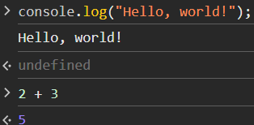
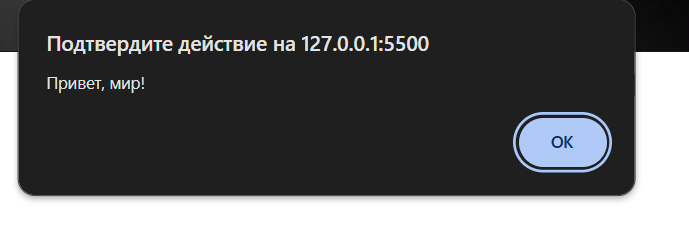
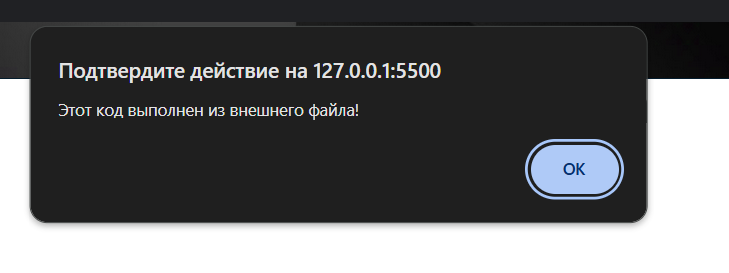
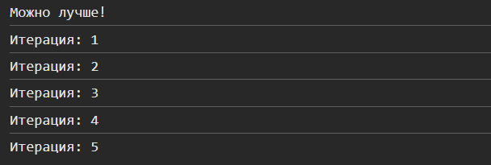

# Лабораторная работа по JavaScript № 1

## 1. Цель работы: 
Познакомиться с основами JavaScript, научиться писать и выполнять код в браузере и в локальной среде, разобраться с базовыми конструкциями языка.

## 2. Запуск проекта: 
- Открыть в любой IDE и запустить локальный сервер.
- В браузере открыть Dev Tools -> Консоль и увидеть результат.

## 3. Выполнение лабораторной работы:
1. В браузерной консоли вводим console.log и смотрим результат. Затем вводим в консоль 2 + 3 и видимо что браузерная консоль выполняет код. 
    

2. Создаю index.html и выполняю следующий код в теге `script`:  
    ```javascript 
    <script>
      alert("Привет, мир!");
      console.log("Hello, console!");
    </script>
    ```
    Результат выполнения кода в браузере: 
    
    

3. Подключаю  в `index.html` внешний файл `js` со следующим кодом: 
    ```javascript 
    alert("Этот код выполнен из внешнего файла!"); 
    console.log("Сообщение в консоли");
    ```
    Результат в браузере:
    
    

4. В файле `script.js` создаю несколько переменных:

    `name` - строка с вашим именем.
    `birthYear` - число, представляющее год вашего рождения.
    `isStudent` - логическая переменная, указывающая, являетесь ли вы студентом.

    Вывожу эти переменные в консоли:
    

5. Добавляю следующий код во внешний файл `script.js`:
    ```javascript
    let score = prompt("Введите ваш балл:");
    if (score >= 90) {
      console.log("Отлично!");
    } else if (score >= 70) {
      console.log("Хорошо");
    } else {
      console.log("Можно лучше!");
    }

    for (let i = 1; i <= 5; i++) {
      console.log(`Итерация: ${i}`);
    }
    ```

    Результат выполнения кода:
    

## 4. Ответы на контрольные вопросы:
1. Чем отличается `var` от `let` и `const`?

    `var`, `let` и `const` — это ключевые слова для объявления переменных в `JavaScript`, но они имеют разные свойства:

    🔹`var` - устарел и не рекомендуется к использованию (имеет функциональный scope).

    🔹`let` - используется для переменных, которые могут изменяться (имеет блочный scope).

    🔹`const` - используется для переменных, которые не должны переназначаться (имеет блочный scope).

2. Что такое неявное преобразование типов в `JavaScript`?

    Неявное (или автоматическое) преобразование типов в `JavaScript` происходит, когда `JS` сам меняет тип данных без явного указания.
    
    Примеры:
    ```javascript
    console.log('5' + 3);  // "53" (конкатенация строк)
    console.log('5' - 3);  // 2 (преобразует '5' в число)
    console.log(true + 1); // 2 (true → 1)
    console.log(false + '2'); // "false2" (false → "false")
    ```

    Основные правила:

    - Оператор `+` при сложении строки с чем-то приводит к строке.
    
    - Операторы `-`, `*`, `/` и `>` пытаются привести операнды к числам.
    
    - Логические операции (`!`, `||`, `&&`) конвертируют в `true` или `false`.

3. Как работает `==` в сравнении с `===`?
    - Оператор `==`: сравнивает значение, выполняя приведение типов.

    - Оператор `===`: сравнивает и тип, и значение, без преобразования.

## 5. Использованные источники:

https://developer.mozilla.org/en-US/docs/Web/JavaScript/Reference/Statements/var
https://learn.javascript.ru/variables
https://www.w3schools.com/jsref/met_console_log.asp