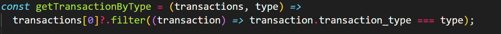

# Лабораторная работа по JavaScript № 2

## Консольное приложение для анализа транзакций.

## Запуск проекта: 
- Открыть в любой IDE и запустить локальный сервер.
- В браузере открыть Dev Tools -> Консоль и увидеть результат.

### Примеры использования проекта с приложением скриншотов или фрагментов кода:

#### Подключаем в html главный скрипт main.js
``` html
<!DOCTYPE html>
<html lang="en">
  <head>
    <meta charset="UTF-8" />
    <meta name="viewport" content="width=device-width, initial-scale=1.0" />
    <title>Document</title>
    <script src="./main.js" type="module"></script>
  </head>
  <body></body>
</html>
```

#### Теперь в файле `main.js` имеет доступ к массиву `transactions`
```javascript
import transactions from "./transactions.js";
```
### Реализация функций: 

1. `getUniqueTransactionTypes` - возвращает массив уникальных типов транзакций.
    

2. `calculateTotalAmount` - вычисляет сумму всех транзакций.
    

3. `calculateTotalAmountByDate(transactions, year, month, day)` [extra]
- Вычисляет общую сумму транзакций за указанный год, месяц и день.

- Параметры `year`, `month` и `day` являются необязательными.

- В случае отсутствия одного из параметров, метод производит расчет по остальным.

    

4. `getTransactionByType(transactions, type)` - Возвращает транзакции указанного типа (`debit` или `credit`).

    

5. `getTransactionsInDateRange(transactions, startDate, endDate)` – Возвращает массив транзакций, проведенных в указанном диапазоне дат от `startDate` до `endDate`.

    

6. `getTransactionsByMerchant(transactions, merchantName)` – Возвращает массив транзакций, совершенных с указанным `merchantName`.

    

7. `calculateAverageTransactionAmount(transactions)` – Возвращает среднее значение транзакций.

    

8. `getTransactionsByAmountRange(transactions, minAmount, maxAmount)` – Возвращает массив транзакций с суммой в заданном диапазоне от `minAmount` до `maxAmount`.

    

9. `calculateTotalDebitAmount(transactions)` – Вычисляет общую сумму дебетовых транзакций.

    

10. `findMostTransactionsMonth` - возвращает месяц, в котором было больше всего транзакций.

    

11. `findMostDebitTransactionMonth(transactions)` – Возвращает месяц, в котором было больше дебетовых транзакций.

    

12. `mostTransactionTypes` - возвращает каких транзакций больше всего.

    

13. `getTransactionsBeforeDate(transactions, date)` – Возвращает массив транзакций, совершенных до указанной даты.

        

14. `findTransactionById` - возвращает транзакцию по ее уникальному идентификатору (`id`).

    

15. `mapTransactionDescriptions(transactions)` – Возвращает новый массив, содержащий только описания транзакций.

    

### Ответы на контрольные вопросы:

#### 1. Какие методы массивов можно использовать для обработки объектов в JavaScript?

- `map()` – создаёт новый массив, преобразуя каждый объект.
- `filter()` – возвращает новый массив с элементами, соответствующими условию.
- `reduce()` – сворачивает массив в одно значение (например, объект, сумму, среднее).
- `forEach()` – перебирает массив без возврата нового массива.
- `find()` – возвращает первый объект, удовлетворяющий условию.

#### 2. Как сравнивать даты в строковом формате в JavaScript?

Если даты хранятся в виде строк `(YYYY-MM-DD или YYYY-MM-DDTHH:mm:ss)`, их можно сравнивать с `Date`:
```javascript
const date1 = new Date("2024-02-07");
const date2 = new Date("2024-02-08");

console.log(date1 < date2); // true
console.log(date1.getTime() === date2.getTime()); // false
```
Для строкового формата даты можно сравнивать как строки, но это работает только, если формат `YYYY-MM-DD`:
```javascript
console.log("2024-02-07" < "2024-02-08"); // true
console.log("2024-02-08T10:00:00" > "2024-02-07T15:00:00"); // true
```

#### 3. В чем разница между map(), filter() и reduce() при работе с массивами объектов?
- `map()` -	Преобразует каждый элемент массива. Возвращает новый массив той же длины
- `filter()` - Оставляет только элементы, удовлетворяющие условию. Возвращает новый массив (может быть короче)
- `reduce()` - Сворачивает массив в одно значение. Возвращает любое значение (число, объект, массив и т. д.)

### Список использованных источников:
- https://developer.mozilla.org/ru/
- https://www.w3schools.com/js/
- https://learn.javascript.ru/

