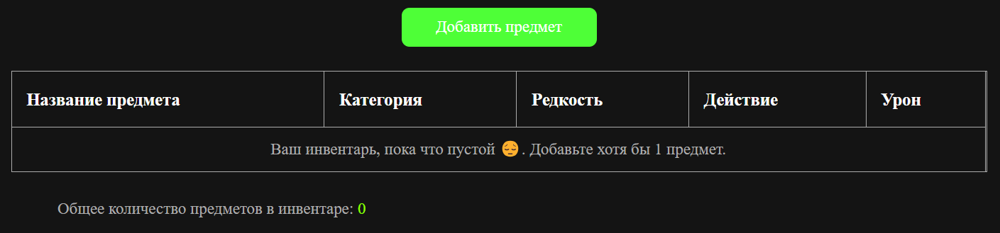
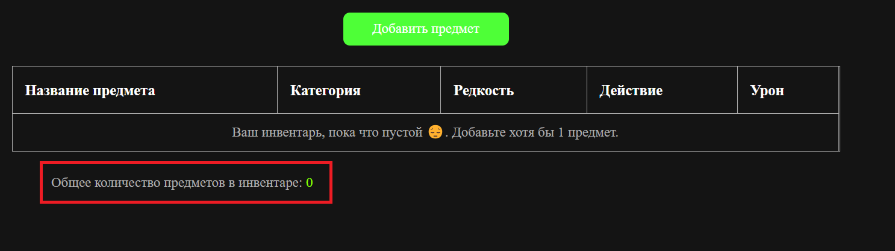
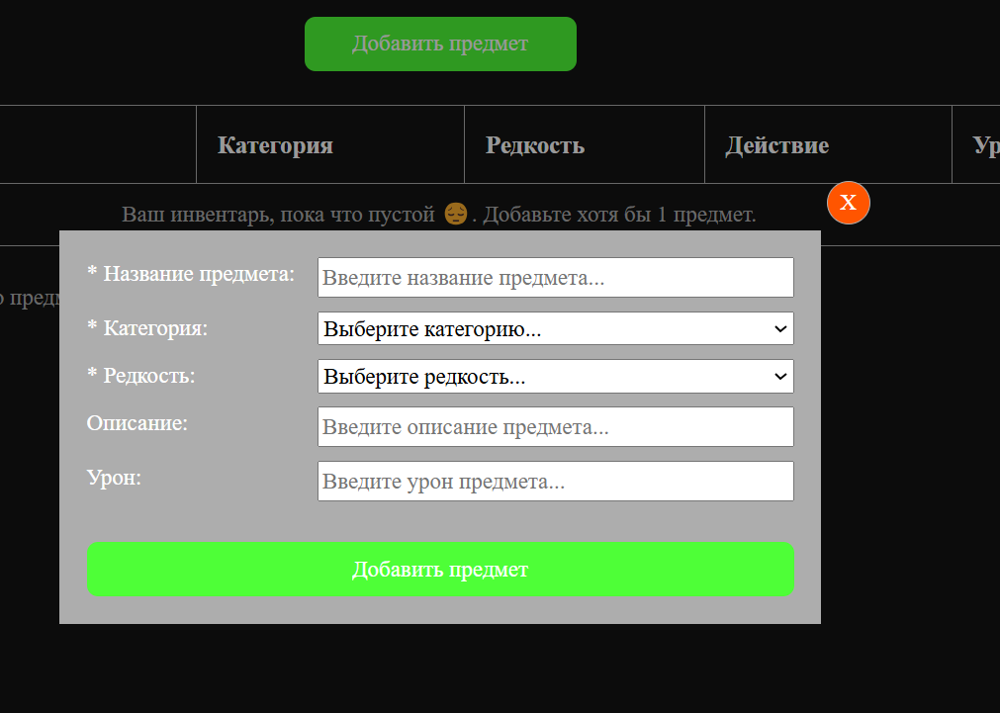

# Лабораторная работа по JavaScript № 4

## Работа с JavaScript в браузере.

## Запуск проекта: 
- Открыть в любой IDE и запустить локальный сервер.
- В браузере открыть Dev Tools -> Консоль и увидеть результат.

### Примеры использования проекта с приложением скриншотов или фрагментов кода:

#### 1. Создаю классы `Item` и `Weapon`:

Поля:

- `id` – уникальный идентификатор предмета.

- `name` – название предмета.

- `category` – категория (armor, weapon, potion).

- `rarity` – редкость (common, uncommon, rare, legendary).

- `description` – описание предмета.

Методы:

- `getInfo()` – возвращает строку с информацией о предмете.

```javascript
class Item {
  constructor(id, name, category, rarity, description) {
    this.id = id;
    this.name = name;
    this.category = category;
    this.rarity = rarity;
    this.description = description;
  }

  getInfo() {
    return `Info about item: id - ${this.id} name - ${this.name},
    category - ${this.category}, rarity - ${this.rarity}, description - ${this.description}`;
  }
}
```

Класс `Weapon` (наследуется от `Item`):

Дополнительные поля:

- `damage` – урон оружия.

Методы:

- `attack()` – выводит сообщение `"Оружие {name} нанесло {damage} урона!"`.

```javascript
class Weapon extends Item {
  constructor(id, name, category, rarity, description, damage) {
    super(id, name, category, rarity, description);
    this.damage = damage;
  }

  attack() {
    return `"Оружие ${this.name} наносит ${this.damage} урона!".`;
  }

  getInfo() {
    const itemInfo = super.getInfo();
    return `${itemInfo}, damage - ${this.damage}`;
  }
}
```

#### 2. Таблица в браузере для отображения данных:

```html
<table class="inventory-table">
  <thead class="inventory-table__head">
    <tr class="inventory-table__row">
      <th class="inventory-table__header-cell">Название предмета</th>
      <th class="inventory-table__header-cell">Категория</th>
      <th class="inventory-table__header-cell">Редкость</th>
      <th class="inventory-table__header-cell">Действие</th>
      <th class="inventory-table__header-cell">Урон</th>
    </tr>
  </thead>
  <tbody
    class="inventory-table__body"
    data-js-inventory-table-body
  ></tbody>
</table>
```


#### 3. Создаю абстрактный класс `BaseComponent`, который позволяет реактивно обновлять UI:

Используется API `Proxy`, который позволяет отлавливать изменение в объекте и вызывать метод `updateUI()`

```javascript
class BaseComponent {
  constructor() {
    if (this.constructor === BaseComponent) {
      throw new Error("Can't instantiate abstract class 'BaseComponent'!");
    }
  }

  getProxyState(initialState) {
    return new Proxy(initialState, {
      get: (target, prop) => {
        return target[prop];
      },

      set: (target, prop, newValue) => {
        const oldValue = target[prop];

        target[prop] = newValue;

        if (newValue !== oldValue) {
          this.updateUI();
        }

        return true;
      },
    });
  }

  updateUI() {
    throw new Error("Need to be implemented method 'updateUI()'!");
  }
}
```

#### 4. Создаю класс `Inventory`:

Создаю изначальное состояние `initialState` для инвентаря:
```javascript
initialState = {
  data: [],
  currentId: 0,
};
```

Создаю метод `addItem(data)`, который добавляет новый предмет в инвентарь, `data` данные из формы:
```javascript
addItem = (data) => {
  const isWeapon = data.damage.trim().length > 0;
  const { name, category, rarity, description, damage } = data;

  if (isWeapon) {
    this.state.data.push(
      new Weapon(
        this.state.currentId,
        name,
        category,
        rarity,
        description,
        damage
      )
    );
  } else {
    this.state.data.push(
      new Item(this.state.currentId, name, category, rarity, description)
    );
  }

  this.state.currentId++;
};
```

Отображаю данную строку сразу же, так как в `state` изменился `data`:
```javascript
this.state.data.forEach((item) => {
  const { id, name, category, rarity } = item;

  const damageInfo = item.attack?.();

  this.tableBodyElement.insertAdjacentHTML(
    "beforeEnd",
    getTableRowTemplate(parseInt(id) + 1, name, category, rarity, damageInfo)
  );
});
```

Создаем новую строку таблицы с данными предмета.

- Если предмет легендарный, строка должна быть золотого цвета.
- Если предмет обычный, строка должна быть серого цвета.

Проверка на цвет строки происходит следующим кодом:
```javascript
${rarity === "legendary" ? "is-legendary" : ""}
```

```javascript
const getTableRowTemplate = (
  id = 0,
  name = "",
  category = "",
  rarity = "",
  damage = ""
) => `
  <tr class="inventory-table__row ${
    rarity === "legendary" ? "is-legendary" : ""
  }" data-js-inventory-table-row data-js-inventory-table-row-id=${id}>
    <td class="inventory-table__cell">${id}. ${name}</td>
    <td class="inventory-table__cell">${category}</td>
    <td class="inventory-table__cell">${rarity}</td>
    <td class="inventory-table__cell">
      <button
        class="button inventory-table__button-delete"
        title="Удалить предмет"
        type="button"
        data-js-inventory-table-delete-button
      >
        X
      </button>
    </td>
    <td class="inventory-table__cell">${damage || "-"}</td>
  </tr>
`;
```

#### 5. Реализация для каждого предмета удаления его из инвентаря, используя делегирование событий:

- При клике на кнопку удаления предмета, вызывается метод `onDeleteButtonClick(event)`.

- При клике сравнивается в массиве `id` предмета, который сравнивается с `id`, который содержится в `DOM` - элементе (строке таблицы)`.

- Присутствует задержка в 300мс до удаления предмета для того, чтобы отобразить плавную анимацию удаления в браузере.

```javascript
onDeleteButtonClick = (event) => {
  if (event) {
    const isButtonDeleteElement = event.target.closest(
      this.selectors.buttonDelete
    );

    if (isButtonDeleteElement) {
      const tableRowElement = event.target.closest(this.selectors.tableRow);
      const delayMS = 300;
      const buttonDeleteElement = event.target;

      const deleteAfterDelay = () => {
        const elementId = tableRowElement.getAttribute(
          this.stateAttributes.tableRowId
        );
        buttonDeleteElement.disabled = true;

        tableRowElement?.classList.add(this.stateClasses.isDeleting);
        setTimeout(() => {
          this.state.data = this.state.data.filter(
            (item) => parseInt(item.id) !== parseInt(elementId - 1)
          );
          this.onRowMouseOut(event);
        }, delayMS);
      };

      deleteAfterDelay();
    }
  }
};
```

#### 6. Подсчет количества предметов

Отображается в отдельном элементе ниже таблицы:



Изменяет общее количество предметов в инвентаре с помощью длины массива `data`:

```javascript
this.totalCountItemsElement.textContent = this.state.data.length;
```

#### 7. Отображение ниже таблицы полной информации о предмете при наведении на строку таблицы.

```html
<ul class="item-full-info" data-js-item-full-info>
  <li>Название: <span data-js-item-full-info-name></span> </li>
  <li>Категория: <span data-js-item-full-info-category></span> </li>
  <li>Редкость: <span data-js-item-full-info-rarity></span> </li>
  <li>Описание: <span data-js-item-full-info-description></span> </li>
  <li>Урон: <span data-js-item-full-info-damage></span> </li>
</ul>
```

- Проверяем если курсор находится на строке таблицы, то пытаемся найти `id` данного элемента в массиве `data`.

- Затем если нашли, то последовательно заполняем данные списка в браузере информацией из массива `data`.

```javascript
onRowMouseOver = (event) => {
  if (event && this.state.data.length > 0) {
    const tableRowElement = event.target.closest(this.selectors.tableRow);
    const elementId =
      parseInt(tableRowElement?.getAttribute(this.stateAttributes.tableRowId)) -
      1;

    if (elementId >= 0) {
      const item = this.state.data.find((element) => element.id === elementId);
      this.fullInfoItemElement.style.display = "grid";

      const { name, category, rarity, description, damage } = item;
      const displayItemInfo = () => {
        this.fullInfoItemElement.querySelector(
          this.selectors.fullInfoName
        ).textContent = name;
        this.fullInfoItemElement.querySelector(
          this.selectors.fullInfoCategory
        ).textContent = category;
        this.fullInfoItemElement.querySelector(
          this.selectors.fullInfoRarity
        ).textContent = rarity;
        this.fullInfoItemElement.querySelector(
          this.selectors.fullInfoDescription
        ).textContent = description;
        this.fullInfoItemElement.querySelector(
          this.selectors.fullInfoDamage
        ).textContent = damage;
      };

      displayItemInfo();
    }
  }
};
```

#### 8. Добавление предметов через форму

Создаём форму используя `html` и добавляем примитивную проверку для ввода полей:

- `name` - (обязательное) должно начинаться с буквы и иметь минимум 2 символа.

- `category` - (обязательное) выбор из предложенных вариантов.

- `rarity` - (обязательное)  выбор из предложенных вариантов.

- `description` - (необязательное) не должно быть пустым.

- `damage` - (необязательное) вводим с клавиатуры только цифры.

При нажатии на кнопку добавить предмет мы видим следующее модальное окно:



```html
<div class="modal" data-js-modal>
  <form class="modal__content" action="/" data-js-modal-content>
    <div class="field">
      <label for="name">* Название предмета: </label>
      <input
        id="name"
        name="name"
        type="text"
        pattern="^[^\d][A-Za-zА-Яа-яЁё\s]*$"
        minlength="2"
        title="Название должно начинаться с буквы и иметь минимум 2 символа."
        placeholder="Введите название предмета..."
        required
      />
    </div>
    <div class="field">
      <label for="category">* Категория: </label>
      <select id="category" name="category" required>
        <option value="" disabled selected>Выберите категорию...</option>
        <option value="weapon">Оружие</option>
        <option value="armor">Броня</option>
        <option value="potion">Зелье</option>
      </select>
    </div>

    <div class="field">
      <label for="rarity">* Редкость: </label>
      <select id="rarity" name="rarity" required>
        <option value="" disabled selected>Выберите редкость...</option>
        <option value="common">Обычное</option>
        <option value="uncommon">Необычное</option>
        <option value="rare">Редкое</option>
        <option value="legendary">Легендарное</option>
      </select>
    </div>
    <div class="field">
      <label for="description">Описание: </label>
      <input
        id="description"
        name="description"
        type="text"
        placeholder="Введите описание предмета..."
      />
    </div>
    <div class="field">
      <label for="damage">Урон: </label>
      <input
        id="damage"
        name="damage"
        type="number"
        step="0.1"
        placeholder="Введите урон предмета..."
      />
    </div>

    <button
      class="button modal__button-close"
      type="button"
      title="Close modal"
      data-js-modal-button-close
    >
      X
    </button>
    <button
      class="button modal__content-button-confirm"
      type="button"
      data-js-modal-content-button-submit
    >
      Добавить предмет
    </button>
  </form>
</div>
```

#### 9. Вызов метода `attack()` для оружия:

```js
this.state.data.forEach((item) => {
  const { id, name, category, rarity } = item;

  const damageInfo = item.attack?.(); // <-- Здесь проверяем если элемент является оружием, тогда в колонку "Урон" добавляем текст, иначе "-".

  this.tableBodyElement.insertAdjacentHTML(
    "beforeEnd",
    getTableRowTemplate(parseInt(id) + 1, name, category, rarity, damageInfo)
  );
});
```

#### 10. Плавная анимация удаления предмета из инвентаря.

Изначально скрываем элемент при помощи `scaleX()` и при появлении класса `is-deleting` показываем красную полоску поверх строки таблицы.

```scss
&__row {
  position: relative;
  transition-duration: var(--transition-duration);

  &::after {
    @include abs-center;

    content: "";
    width: 100%;
    height: rem(3);
    background-color: var(--color-red);

    transform: scaleX(0) /* <-- Изначально скрываем элемент при помощи scaleX(0) */;
    transform-origin: left;
    transition: transform var(--transition-duration) ease-in-out;
    z-index: 100;
  }

  &.is-deleting {
    & .inventory-table__button-delete {
      cursor: not-allowed;
      opacity: 0.5;
    }

    &::after {
      transform: scaleX(1) /*<-- При появлении класса is-deleting показываем красную полоску поверх строки таблицы при помощи scaleX(1)*/;
    }
  }
}
```

## Контрольные вопросы:

1. Каким образом можно получить доступ к элементу на веб-странице с помощью `JavaScript`?

В `JavaScript` доступ к элементам `DOM` можно получить с помощью следующих методов:

- `document.getElementById(id)` – находит элемент по `id`.

```js
const element = document.getElementById("myElement");
```

- `document.getElementsByClassName(className)` – возвращает `HTMLCollection` элементов с указанным классом.

```js
const elements = document.getElementsByClassName("myClass");
```

- `document.getElementsByTagName(tagName)` – возвращает `HTMLCollection` элементов с указанным тегом.

```js
const elements = document.getElementsByTagName("p");
```

- `document.querySelector(selector)` – возвращает первый найденный элемент по `CSS-селектору`.

```js
const element = document.querySelector(".myClass");
```

- `document.querySelectorAll(selector)` – возвращает `NodeList` всех элементов, соответствующих `CSS-селектору`.

```js
const elements = document.querySelectorAll("div.container");
```

2. Что такое делегирование событий и как оно используется для эффективного управления событиями на элементах `DOM`?

- Делегирование событий – это механизм, при котором обработчик события назначается не конкретному элементу, а его родителю. Это позволяет обрабатывать события на потомках, даже если они добавлены динамически.

- Используется, когда:

  Есть много элементов с одинаковыми обработчиками.
  Элементы добавляются динамически.
  Нужно минимизировать количество обработчиков.

3. Как можно изменить содержимое элемента `DOM` с помощью `JavaScript` после его выборки?

После выбора элемента его содержимое можно изменить несколькими способами:

- Изменение текста внутри элемента:

```js
const element = document.getElementById("myElement");
element.textContent = "Новый текст";
```

- Изменение HTML внутри элемента:

```js
element.innerHTML = "<strong>Жирный текст</strong>";
```

- Изменение атрибутов:

```js
element.setAttribute("data-value", "123");
```

- Изменение стилей:

```js
element.style.color = "red";
```

4. Как можно добавить новый элемент в DOM-дерево с помощью JavaScript?

- Создать и добавить элемент в DOM можно с помощью `document.createElement()` и `appendChild()` / `append()`.

Пример:

```js
const newElement = document.createElement("div"); // Создаём элемент
newElement.textContent = "Я новый элемент"; // Добавляем текст
document.body.appendChild(newElement); // Добавляем в конец <body>
Другие методы добавления:
```

- `prepend()` – добавляют элемент в начало родителя.

```js
parentElement.prepend(newElement);
```
- Перед добавлением можно настроить атрибуты, классы, стили:

```js
newElement.classList.add("my-class");
newElement.style.backgroundColor = "blue";
```

## Список использованных источников:
https://developer.mozilla.org/ru/
https://www.w3schools.com/js/
https://learn.javascript.ru/
